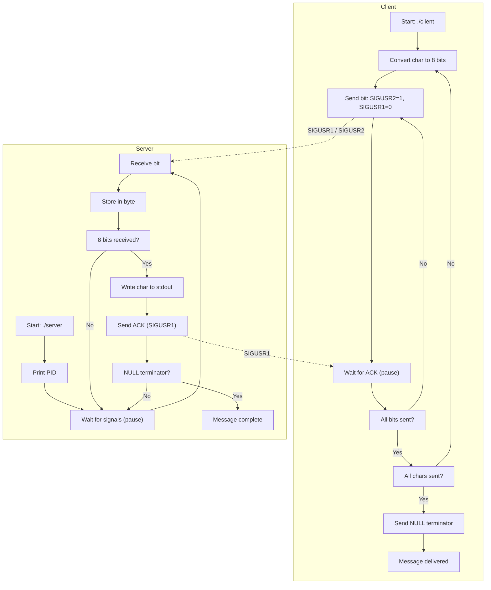

# 42 Cursus : minitalk

<p align="center">
  <a href="https://github.com/your_login/minitalk">
    
  </a>
</p>

## Description

Minitalk is a client-server communication program that transmits messages using UNIX signals.

Instead of using pipes or sockets, this implementation encodes each character into bits and sends them one by one using `SIGUSR1` and `SIGUSR2`.

The server reconstructs the message and prints it to standard output.

## Highlights

- Client-server communication using only UNIX signals
- Configurable message length
- Server acknowledgment for each message
- Unicode support
- Multiple clients supported without server restart
- One global variable per program (properly justified)
- Written in C following the official 42 coding standard, enforced by **[42 Norminette](https://github.com/42school/norminette)**

## Instructions

```sh
# Compile
make

# Start the server
./server

# Send a message (in another terminal)
./client <server_pid> "Your message here"

# Example
$ ./server
SERVER PID: 12345

$ ./client 12345 "Hello こんにちは 🚀"
Hello こんにちは 🚀
```

## Diagram



## Design

### Bitwise Encoding + Acknowledgment

```c
// Send bit: SIGUSR2 = 1, SIGUSR1 = 0
if (c & (1 << bit))
    kill(pid, SIGUSR2);
else
    kill(pid, SIGUSR1);

// Wait for ACK
while (!g_status)
    pause();

// Server sends ACK after each byte
kill(info->si_pid, SIGUSR1);
```

- 8 signals per character, server reconstructs byte
- Client pauses after each bit, waits for server ACK
- Prevents signal loss and ensures reliable transmission

### Signal Handling

```c
// Server uses sigaction with SA_SIGINFO
struct sigaction sa;
sa.sa_sigaction = handle_signal;
sa.sa_flags = SA_SIGINFO;
sigemptyset(&sa.sa_mask);
sigaction(SIGUSR1, &sa, NULL);
sigaction(SIGUSR2, &sa, NULL);
```

- `SA_SIGINFO` provides the client's PID for acknowledgment
- Blocked signals are masked during handler execution

### Server Persistence

```c
static int bit;      // Tracks current bit position (0-7)
static int current;  // Accumulates bits into a byte
```

- Static variables maintain state between signals
- Server stays running, accepts multiple clients sequentially
- State resets after each complete character

### Memory Safety

- No dynamic memory allocation in signal handlers
- No memory leaks (no heap allocation at all)
- Only stack-allocated variables and static storage

## Bonus

```c
// Server acknowledgment: send SIGUSR1 back after each byte
kill(info->si_pid, SIGUSR1);

// Client waits for acknowledgment before sending next bit
while (!g_status)
    pause();

// Unicode support: send raw bytes directly
// Works with any UTF-8 characters: 日本語, 한국어, ภาษาไทย, 🚀
send_byte(pid, (unsigned char)message[i]);
```

---

Passed. No regrets.

I recommend doing Pipex instead though.

**[@42Monkey 🐒](https://github.com/42Monkey)**
